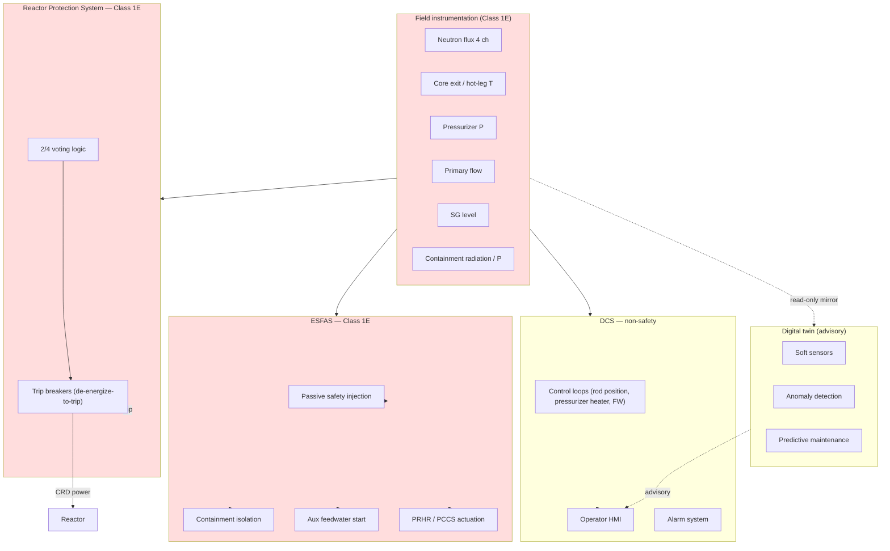
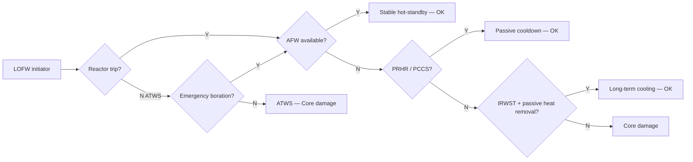

# W1 Plan — 3S Safety / I&C / FOM

**Owner:** Azamhon
**Week:** 2026-W22 (start 2026-05-26)
**Project:** Aegis-40 (40 MWe net / 125 MWth cogeneration iPWR) — TEKNOFEST 2026 Detail Design
**FER sections owned:** §8.5 Safety Criteria · §8.6 Reactor Safety Systems Design · §8.7 I&C System Design · §8.12 FOM rollup (cross-cutting)
**Companion docs:** `PLAN.md`, `SIMULATION_REQUIREMENTS.md`, `MEETING_BRIEF.md`, `Final_Template.docx`, `Aegis-40 2D test/` (Samira's stable OpenMC)

---

## 0. Inputs assimilated this session

### From `Final_Template.docx` (FER organizers' template)
- Category: Detailed Design — 40 MWe Modular PWR (confirms 40 MWe net to grid)
- Max 120 pages, Arial 12, 1.15 spacing, justified.
- §8.5–§8.7 = my scope. §8.6 explicitly requires:
  - Fault trees + event trees with redundancy/necessity analysis
  - Schematic of how protective actions derive from monitored variables (flux, T, flow)
  - Auto-actuation of safety systems on fuel-limit excursion
  - Fail-safe transition under loss of power / instrument air / extreme env
- §8.7 explicitly requires:
  - I&C architecture + block, logic, flow diagrams
  - Sensors, detectors, instruments
  - HMI design, secure comms
  - Redundancy, diversity, physical separation
  - Ergonomic main control room
- **Pre-filled Table 1 baseline** (use these or override with design data):
  - Design life 60 y · capacity factor 95 %
  - Net electric / thermal: ~40 MWe / 125 MWth (we set thermal)
  - EPZ 0.5 km · SSE 0.3 g
  - SG pressure 7.17 MPa · primary inventory 1.82e6 kg · flow 1827 kg/s
  - Core T_in/T_out 270/288 °C · process heat 100–260 °C flexible
  - Containment: dry, 4.14 bar (60 psi) design
  - Fuel: UO₂, avg/max enrichment 3.81 / 4.95 % · Zircaloy-2 clad · 240 assemblies · ~50 GWd/MTU
  - Burnable absorbers: B₄C, Hf, Gd₂O₃
  - Safety trains: shutdown ×3, ECCS ×3 passive, containment isolation ×3, passive containment ×3
  - CDF target < 1e-7 /ry · LRF < 1e-8 /ry

### From `Aegis-40 2D test/` (Samira — stable baseline)
- 2D core, three radial UO₂ zones: inner 2.6 % / middle 3.0 % / outer 3.4 % U-235 (lower than template's 3.81 % avg — design choice; flag in safety table footnote)
- HIGA burnable absorber = Gd₂O₃-Al₂O₃ at 12 mol % Gd₂O₃, Gd-155 enriched, ρ 4.679 g/cm³
- Cladding Zircaloy-4 (template says Zr-2; harmonize later)
- Moderator H₂O at 0.7405 g/cm³, T_default 557 K (~284 °C) — matches Table 1 outlet T
- Box 185 × 185 × 190 cm
- k_eff(BOL) = 1.00722 ± 165 pcm — slightly supercritical, expected for HZP fresh
- k_eff(5 d) = 0.97814 ± 175 pcm — strong Gd hold-down, ~−290 pcm/day so far
- ρ(5 d) = −2235 pcm
- Status: 5-day short depletion done. MTC/DTC/void sweeps pending (Samira this week).

### Cross-checks needed (flag and resolve before §8.5 freeze)
| Item | Template says | Samira's model | Action |
|---|---|---|---|
| Cladding | Zircaloy-2 | Zircaloy-4 | confirm with core team — Zr-4 standard for PWR |
| Avg enrichment | 3.81 % | ~3.0 % | track design intent; lower enrichment shortens cycle |
| Burnup target | ~50 GWd/MTU | TBD (long depletion not run yet) | wait for Samira's depletion sweep |
| Burnable absorber | B₄C / Hf / Gd₂O₃ | Gd₂O₃ (HIGA only) | OK — Gd₂O₃ matches |

---

## 1. Goal of the week

> Build the safety + I&C framework that ingests every team's numerical output and produces a self-consistent picture for FER §8.5–§8.7 + a FOM rollup template.

**Hard deliverables EOW (Sun 2026-05-31):**
1. `safety_criteria.yaml` + Markdown render → seeds FER §8.5
2. `ic_architecture.md` + Mermaid block diagram (`ic_block.mmd`) → seeds FER §8.7
3. `event_tree_LOHS.md` (or .png from draw.io) → seeds FER §8.6
4. `fom_inputs.yaml` template + 1-page README → integration contract

**Stretch deliverables:**
- Trip signals table → seeds FER §8.6 + §8.7
- `fom_validate.py` (10–30 lines, schema check)
- Second event tree (SBO) draft

---

## 2. Day-by-day schedule

### Day 1 (Mon) — Safety criteria table

**Output:** `safety_criteria.yaml`

Structure each entry as:
```yaml
- id: pct_loca
  parameter: "Peak Clad Temperature (LOCA)"
  limit_value: 1204
  unit: "°C"
  type: hard_constraint          # hard_constraint | operating_limit | target
  source: "10 CFR 50.46 / IAEA SSR-2/1"
  normalizer: target_gaussian    # log_ratio | min_max | target_gaussian
  fom_param: PCT_max
  sensor_chain: ["core exit TC", "fuel performance model"]
  setpoint_link: high_outlet_temp_trip
  notes: "Hard constraint — breach => wFOM = -inf"
```

**Rows (minimum 15):**

| ID | Parameter | Limit | Type | Source |
|---|---|---|---|---|
| `k_eff_op` | Operating k_eff | 1.000 ± 50 pcm | operating | IAEA SSR-2/1 |
| `k_eff_shutdown` | Shutdown k_eff | ≤ 0.99 | hard | NRC GDC-26 |
| `mdnbr_steady` | MDNBR steady-state | ≥ 1.3 | hard | NUREG-0800 |
| `pct_loca` | Peak Clad T (LOCA) | ≤ 1204 °C | hard | 10 CFR 50.46 |
| `fuel_centerline` | Fuel centerline T | < 2590 °C | hard | ANS / fuel limit |
| `primary_p_design` | Primary pressure | ≤ 17.2 MPa | hard | ASME III |
| `containment_p` | Containment P | ≤ 4.14 bar | hard | Template Table 1 |
| `mtc_fp` | MTC, full power | < 0 pcm/K | operating | NRC GDC-11 |
| `dtc` | DTC | < 0 pcm/K | operating | NRC GDC-11 |
| `void_coeff` | Void coefficient | < 0 | operating | NRC GDC-11 |
| `sdm` | Shutdown margin | ≥ 1 % Δk/k | hard | tech spec |
| `epz_radius` | EPZ radius | ≤ 0.5 km | target | Template Table 1 |
| `grace_period` | Operator grace | ≥ 72 h (target ∞) | target | SMR best practice |
| `cdf` | Core damage freq | < 1e-7 /ry | target | Template Table 1 |
| `lrf` | Large release freq | < 1e-8 /ry | target | Template Table 1 |
| `dose_boundary` | Site boundary dose | ≤ 100 mSv (LOCA) | hard | 10 CFR 100 |
| `sbf_diversity` | Diversity principles | ≥ 5 | target | MEETING_BRIEF §4 |

Each row carries `fom_param` + `normalizer` so it plugs directly into [[fom_inputs]] and the [[wfom_engine]] PLAN.md.

**Render `.md` from `.yaml`** with a small jinja template — judges read MD, code consumes YAML.

**Time:** 4 h.

---

### Day 2 (Tue) — I&C architecture text + sensor inventory

**Output:** `ic_architecture.md`

**Section structure (mirrors FER §8.7 requirements):**
1. Design principles — defense-in-depth, redundancy (4× neutron channels, 4× P/T), diversity (different physical principles), physical separation (Class 1E vs DCS), single-failure criterion, fail-safe (de-energize-to-trip).
2. Architecture overview — five layers:
   1. Field sensors
   2. RPS (Reactor Protection System) — Class 1E, hardwired, 2/4 voting
   3. ESFAS (Engineered Safety Features Actuation System)
   4. DCS (Distributed Control System) — non-safety
   5. Digital twin monitoring layer — non-safety, advisory
3. Sensor inventory (table below)
4. HMI + main control room ergonomics — large screen, alarm hierarchy, 2-operator minimum, soft procedures.
5. Standards — IEC 61513 (general), IEC 60880 (Class 1E SW), IEEE 603 (safety system criteria), IEC 62138 (Cat B/C SW), IAEA SSG-39.

**Sensor inventory table:**
| Channel | Sensor | Qty | Range | Redundancy | Class | Feeds |
|---|---|---|---|---|---|---|
| Source-range neutron | Fission chamber | 2 | 1 – 1e6 cps | 1/2 trip | 1E | RPS, startup |
| Intermediate-range neutron | Compensated ion chamber | 2 | 1e-8 – 1e-3 A | 1/2 | 1E | RPS, startup |
| Power-range neutron | Uncompensated IC | 4 | 0 – 125 % | 2/4 | 1E | RPS, control |
| Hot-leg T | RTD (Pt100) | 4 | 0 – 350 °C | 2/4 | 1E | RPS, control |
| Cold-leg T | RTD | 4 | 0 – 350 °C | 2/4 | 1E | RPS |
| Core exit T | Thermocouple | 8 | 0 – 1200 °C | array | 1E | RPS, post-acc monitoring |
| Pressurizer P | Pressure xmtr | 4 | 0 – 20 MPa | 2/4 | 1E | RPS, control |
| Loop flow | Venturi / UFM | 2/loop | 0 – 110 % | 2/4 | 1E | RPS |
| SG level (narrow) | dP | 4/SG | 0 – 100 % | 2/4 | 1E | RPS, AFW init |
| SG level (wide) | dP | 2/SG | 0 – 100 % | — | non-1E | post-accident |
| Containment P | Pressure xmtr | 4 | 0 – 0.5 MPa | 2/4 | 1E | ESFAS |
| Containment radiation | Gamma + particulate | 4 | wide-range | — | 1E | ESFAS, isolation |
| Pressurizer level | dP | 4 | 0 – 100 % | — | non-1E | control |

**Time:** 4 h.

---

### Day 3 (Wed) — I&C block diagram

**Output:** `ic_block.mmd` (Mermaid) + PNG export

Mermaid skeleton (refine with real signal lines and trip combinations):



Export PNG via `mmdc` (mermaid-cli) or paste into mermaid.live.

**Time:** 2 h.

---

### Day 4 (Thu) — Trip signals + LOHS event tree

**Outputs:** `trip_signals.md`, `event_tree_LOHS.md`

#### 4a. Trip signals (`trip_signals.md`)

| Trip | Variable | Setpoint | Logic | Actuated | Permissive bypass |
|---|---|---|---|---|---|
| High power-range flux | Neutron flux | 118 % rated | 2/4 | CRD trip, ESFAS | P-10 (below 10 % power) |
| High flux rate | dN/dt | +5 % rated/s | 2/4 | CRD trip | — |
| High T_out | Core exit T | 305 °C | 2/4 | CRD trip | — |
| High Δ T (over-temp) | T_avg + flux + P | composite | 2/4 | CRD trip | — |
| Low flow | Loop flow | 90 % rated | 2/4 per loop | CRD trip | P-7 (low power) |
| Low pressurizer P | P | 12.5 MPa | 2/4 | CRD + SI | startup bypass |
| High pressurizer P | P | 16.5 MPa | 2/4 | CRD + PORV | — |
| Low SG level | SG narrow-range | 15 % | 2/4 per SG | CRD + AFW | — |
| High containment P | Cont P | 0.17 MPa | 2/3 | CRD + CI | — |
| High containment radiation | γ | 100 × bkg | 2/3 | CI + ventilation | — |
| Manual scram | — | — | 1/2 | CRD trip | — |

Each setpoint links to a `safety_criteria.yaml` row (`setpoint_link` field).

#### 4b. LOHS event tree (`event_tree_LOHS.md`)

**Initiator:** Loss of main feedwater (LOHS) — design-basis transient.
**Mission time:** 72 h.



For each branch: success criterion, mission time, point-estimate or TBD reliability. List source-term release class (OK / CD / LERF).

**Why LOHS over SBO:** discriminates passive-decay-heat-removal claim, which is iPWR USP for FER §5.

**Time:** 4 h.

---

### Day 5 (Fri) — FOM update template + integration glue

**Outputs:** `fom_inputs.yaml`, `fom_README.md`, optional `fom_validate.py`

#### 5a. `fom_inputs.yaml` (contract — handed to all teams)

```yaml
design_id: aegis40-rev_X
timestamp: 2026-05-31
schema_version: 0.1

from_openmc:
  k_eff_bol: ~
  k_eff_eol: ~
  mtc_full_power_pcm_per_K: ~
  dtc_pcm_per_K: ~
  void_coeff_pcm_per_pct: ~
  control_rod_worth_aro_pcm: ~
  shutdown_margin_dk_pct: ~
  cycle_length_efpd: ~
  enrichment_avg_pct: 3.0
  enrichment_max_pct: 3.4
  burnup_discharge_GWd_per_MTU: ~
  power_peaking_radial: ~
  power_peaking_axial: ~

from_openfoam:
  inlet_T_C: 270
  outlet_T_C: 288
  primary_pressure_MPa: 15.5
  mass_flow_kg_per_s: 1827
  mdnbr_steady: ~
  hot_channel_pct_C: ~
  pressure_drop_kPa: ~

from_tes_soe:
  net_electric_MWe: 40
  thermal_MWth: 125
  district_heat_MWth: ~
  H2_kg_per_year: ~
  tes_storage_MWh: ~
  soe_efficiency: ~

from_layout_economics:
  footprint_m2: ~
  epz_km: 0.5
  capex_usd_per_kWe: ~          # may stay null
  specific_revenue_usd_per_kWe_yr: ~

derived_safety:                  # computed by ME from above + safety_criteria.yaml
  passive_decay_heat_removal_grace_h: ~
  sbf_diversity_count: ~
  hard_constraints_passed: ~
  failed_constraints: []

fom_score:                       # computed by wfom engine (PLAN.md tool)
  category_scores:
    safety: ~
    economic: ~
    safeguards: ~
    sustainability: ~
    efficiency: ~
  wfom_vs_CAREM25: ~
  wfom_vs_SMART: ~
  wfom_vs_VOYGR: ~
```

#### 5b. `fom_README.md` — half page
Explain:
- Who fills which block
- Units everywhere
- `~` = null = TBD (validator flags)
- When you change a number, re-run `make all` (per PLAN.md)
- This file is the SINGLE source of truth — no values in slides, only here

#### 5c. `fom_validate.py` (stretch, ~30 lines)

```python
import yaml, sys
required = {
  "from_openmc": ["k_eff_bol", "mtc_full_power_pcm_per_K", "dtc_pcm_per_K"],
  "from_openfoam": ["mdnbr_steady", "hot_channel_pct_C"],
  "from_tes_soe": ["net_electric_MWe", "thermal_MWth"],
}
d = yaml.safe_load(open(sys.argv[1]))
missing = [(k, f) for k, fs in required.items() for f in fs if d.get(k, {}).get(f) is None]
print("MISSING:", missing) if missing else print("OK")
sys.exit(1 if missing else 0)
```

**Time:** 3 h.

---

### Day 6 (Sat) — Buffer + polish

- Resolve teammate questions returned during week
- Cross-check `safety_criteria.yaml` rows against `trip_signals.md` (every hard-constraint row must have at least one trip OR a justification why not)
- Render all YAML → MD for FER drop-in
- Push everything to repo (init git if not done)

**Time:** 3 h.

---

### Day 7 (Sun) — Review + write supervisor brief

- Update `MEETING_BRIEF.md` with the 7 new artifacts
- Identify open questions / supervisor sign-offs needed before W2
- Estimate W2 scope (start SBO event tree, expand sensor inventory, get OpenFOAM MDNBR plugged in)

**Time:** 2 h.

---

## 3. Coordination — pings to send Monday morning

| Person | What I need | When | Why |
|---|---|---|---|
| **Samira (OpenMC)** | DTC, MTC (full-power), void coefficient, shutdown margin estimate from her sweep results | Wed EOD | safety_criteria.yaml rows + fom_inputs.yaml |
| **Samira** | Confirm fuel cladding: Zr-2 (template) or Zr-4 (her model)? | Mon | freeze before §8.3 / §8.5 |
| **Samira** | When will long depletion (full cycle) run? Need EOC k_eff + burnup | Mon | fills cycle_length_efpd, burnup_discharge |
| **OpenFOAM lead** | MDNBR steady-state estimate + hot-channel PCT from first run | Fri | hard constraints + fom_inputs |
| **OpenFOAM lead** | Confirm T_in/T_out 270/288 °C and 1827 kg/s — match Samira's 557 K | Mon | basis for both teams |
| **Alisher (TES/SOE)** | net MWe split, district heat MWth, H₂ kg/yr | Wed | fom_inputs economic + sustainability rows |
| **Elbek (Layout)** | Footprint m², EPZ assumption (default 0.5 km from template) | Fri | fom_inputs layout row |
| **Supervisor** | 10 sign-offs from `MEETING_BRIEF.md` §4 — weights, prices, Gaussian centers, etc. | Whenever you next meet | unlocks wFOM weights — until then placeholders |
| **Supervisor** | Confirm 40 MWe net + 125 MWth split. Confirm η ≈ 32 % | Mon | locks baseline |

---

## 4. Standards / references to cite (build bibliography while writing)

- IAEA SSR-2/1 Rev. 1 — Safety of NPPs: Design
- IAEA SSG-39 — Design of I&C systems
- IAEA SSG-30 — Safety Classification of SSCs
- IEC 61513 — I&C systems important to safety, general requirements
- IEC 60880 — Class 1E software
- IEC 62138 — Cat B/C software
- IEEE 603 — Standard Criteria for Safety Systems
- IEEE 7-4.3.2 — Digital computers in safety systems
- 10 CFR 50.46 — ECCS acceptance criteria (PCT 1204 °C)
- 10 CFR 100 — Reactor site criteria (dose)
- NUREG-0800 — SRP (MDNBR ≥ 1.3, etc.)
- NRC GDC-10/11/15/20/26 — fuel, reactivity, design limits, protection
- ASME Section III — pressure vessel
- ANS standards — fuel performance, decay heat

---

## 5. Risks + mitigations

| Risk | Mitigation |
|---|---|
| OpenFOAM team hasn't produced MDNBR by Fri → can't populate hard constraint | Use NUREG-typical placeholder ≥ 1.3 with `TBD-from-CFD` flag; constraint still definable |
| Supervisor weights not signed off | Continue with PLAN.md defaults (35/20/15/15/15); document that final scores will re-run |
| Samira's enrichment (~3.0 %) ≠ template (3.81 %) | Decide: match template or document deviation. Recommend document — design choice. |
| Mermaid diagrams don't render in Word for FER | Export to PNG via `mmdc`; embed PNG; keep `.mmd` source in repo |
| 120-page FER limit | My sections likely 12–18 pp combined. Keep tables compact. |
| Zr-2 vs Zr-4 mismatch | Ask Samira. Zr-4 is standard PWR — flag template as needing update |

---

## 6. Files this week creates (under repo root)

```
W1_Plan.md                          # this file
safety/
  safety_criteria.yaml              # spine — Day 1
  safety_criteria.md                # rendered for FER §8.5
  trip_signals.md                   # Day 4 — feeds §8.6/§8.7
  event_tree_LOHS.md                # Day 4 — feeds §8.6
ic/
  ic_architecture.md                # Day 2 — feeds §8.7
  ic_block.mmd                      # Day 3 — source
  ic_block.png                      # Day 3 — render for FER
  sensor_inventory.md               # Day 2 — feeds §8.7
fom/
  fom_inputs.yaml                   # Day 5 — integration contract
  fom_README.md                     # Day 5 — how teams use it
  fom_validate.py                   # Day 5 — stretch
```

---

## 7. FER mapping (where each artifact lands)

| FER section | Artifact |
|---|---|
| §8.5 Safety Criteria | `safety_criteria.md` + standards table |
| §8.6 Reactor Safety Systems Design | `event_tree_LOHS.md` + safety-systems narrative (W2) |
| §8.7 I&C System Design | `ic_architecture.md` + `ic_block.png` + `sensor_inventory.md` + `trip_signals.md` |
| §8.12 Economic Eval (indirect) | `fom_inputs.yaml` — populates Specific Revenue per `MEETING_BRIEF.md` §2.5 |
| Digital Appendix | `fom_inputs.yaml`, `safety_criteria.yaml`, `*.mmd` sources |

---

## 8. EOW self-check

Tick each before declaring W1 done:

- [ ] `safety_criteria.yaml` ≥ 15 rows, every hard-constraint row has `setpoint_link` or justification
- [ ] `ic_architecture.md` covers all 7 items from W1 task list (neutron, T, P, flow, RPS, DCS, twin)
- [ ] Block diagram exports cleanly to PNG (no broken nodes)
- [ ] LOHS event tree has ≥ 4 top events and at least 1 OK and 1 CD end-state
- [ ] `fom_inputs.yaml` validated against template (all five team blocks present)
- [ ] All teammates pinged, replies logged in `coordination_log.md` (create if needed)
- [ ] 7 supervisor questions / sign-offs documented in `MEETING_BRIEF.md` update

---

*End of W1 plan.*
