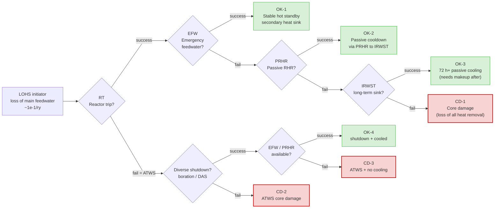

# Event Tree — Loss of Heat Sink (LOHS) — Aegis-40

*Source document. Drop into FER §8.6 (event trees, redundancy & necessity analysis).*
*Companion: `trip_signals.md` (I&C that drives the top events), `safety_criteria.yaml` (the limits whose breach = core damage), `event_tree_LOHS.png` (rendered).*
*Owner: Azamhon. Last updated: 2026-05-28.*

---

## 1. Why LOHS (and not SBO)

Loss of Heat Sink — loss of the normal secondary-side path that removes core heat (loss of main feedwater / loss of condenser) — is chosen as the first event tree because it **directly exercises the passive decay-heat-removal chain that is the iPWR's selling point** (FER §5 originality). It discriminates our design from a generic PWR more than Station Blackout does. SBO is planned as the second tree (W2).

---

## 2. Initiator and mission

| Item | Value |
|---|---|
| **Initiating event** | Loss of main feedwater / loss of normal heat sink (LOHS) |
| **Initiator frequency** | ~1e-1 /reactor-year `[PRA-PENDING]` (typical LOFW) |
| **Mission time** | 72 h (matches `operator_grace_period` target) |
| **Success end-state** | Stable, coolable core; fission-product barriers intact |
| **Failure end-state** | Core damage (CD) — breach of `pct_loca` / `fuel_centerline_temperature` |
| **Decay heat basis** | ANS-5.1; ~6.5 % P at 1 s, ~1 % at 1 h after scram |

---

## 3. Top events (in order of demand)

| # | Top event | Success criterion | System(s) | I&C trigger (from `trip_signals.md`) |
|---|---|---|---|---|
| **RT** | Reactor trip | Rods inserted, power → decay levels | RPS (+ DAS diverse) | `low_sg_level_trip` / `over_temp_dt_trip` |
| **EFW** | Emergency feedwater | ≥ 1 SG fed, secondary heat sink restored | Gravity EFW from elevated tank (passive) | E3 (`low_sg_level_trip`) |
| **PRHR** | Passive residual heat removal | PRHR HX removes ≥ 105 % decay heat to IRWST | PRHR/PCCS (passive natural circ) | E4 |
| **IRWST** | Long-term passive heat sink | IRWST inventory + containment condensation ≥ 72 h | IRWST + passive containment cooling | E4 latched |
| **BOR/DAS** | (ATWS branch only) Diverse shutdown | Subcriticality without rods | Emergency boration **or** DAS diverse rod insertion | DAS |

---

## 4. Event tree (logic)

---

## 5. Sequence table

| Seq | Path | End state | Class | Approx. frequency `[PRA-PENDING]` | Dominant dependency |
|---|---|---|---|---|---|
| S1 | RT·EFW | OK-1 | Safe (hot standby) | ~1e-1 | EFW tank availability |
| S2 | RT·¬EFW·PRHR | OK-2 | Safe (passive cooldown) | ~1e-3 | PRHR train (≥1 of 2) |
| S3 | RT·¬EFW·¬PRHR·IRWST | OK-3 | Safe (72 h passive) | ~1e-5 | IRWST inventory + containment condensation |
| S4 | RT·¬EFW·¬PRHR·¬IRWST | **CD-1** | Core damage | ~1e-8 | total loss of heat removal |
| S5 | ¬RT·BOR·EFW2 | OK-4 | Safe (diverse shutdown) | ~1e-6 | DAS / boration + cooling |
| S6 | ¬RT·BOR·¬EFW2 | **CD-3** | Core damage | ~1e-9 | ATWS + cooling failure |
| S7 | ¬RT·¬BOR | **CD-2** | Core damage | ~1e-10 | ATWS unmitigated |

**CDF contribution (this initiator, preliminary):** Σ(S4,S6,S7) ≈ **1e-8 /ry** `[PRA-PENDING]` — about an order of magnitude **below** the `cdf < 1e-7` *plant* target, leaving budget for the remaining initiators. Total plant CDF sums all initiators (W2+); no single initiator may consume the whole 1e-7 allocation.

---

## 6. Redundancy & necessity analysis (FER §8.6 explicit requirement)

| System | Redundancy | Necessity (what fails without it) | Diversity |
|---|---|---|---|
| RPS | 4 div, 2/4 | Without trip → ATWS (S5–S7) | DAS (diverse platform) backs it up |
| EFW | elevated tank, gravity | First-line secondary sink; loss → demand on PRHR | Diverse from PRHR (different sink) |
| PRHR | 2 trains, 100 % each | Passive cooldown; loss → demand on IRWST | Natural circ, no power needed |
| IRWST | single large pool | Ultimate heat sink for 72 h | Containment condensation return |
| Containment cooling | 3 passive trains | Maintains IRWST sink + condenses steam | Continuously in service |

**Necessity conclusion:** no single system failure leads directly to core damage — every CD sequence requires **≥ 2 independent failures** (e.g. S4 needs EFW *and* PRHR *and* IRWST all to fail). This demonstrates the single-failure criterion is met at the accident-sequence level, not just the component level.

---

## 7. I&C role through the sequence (ties to §8.7)

1. **t = 0:** main feedwater lost → SG level drops → `low_sg_level_trip` (2/4) → **reactor trip** (RT top event) + auto-start EFW (E3).
2. **EFW success:** SG level recovers, plant at hot standby. Operator confirms on HMI; digital twin flags heat-sink margin.
3. **EFW fail:** core-exit T rises post-scram → E4 → **PRHR** aligns to IRWST by natural circulation. No operator action, no power needed (de-energize-to-actuate).
4. **PRHR fail:** IRWST + passive containment cooling carry decay heat ≥ 72 h. Wide-range SG level (L-SG-WR) + core-exit TCs (T-CE) are the RG 1.97 post-accident monitors confirming the sink holds.
5. **ATWS (¬RT):** DAS detects sustained high flux + pressure → diverse rod insertion / boration.

Every top-event actuation is initiated by a trip/ESF signal already specified in `trip_signals.md`. The event tree is the *dynamic* view of that static table.

---

## 8. Open items

| # | Item | Impact | Owner |
|---|---|---|---|
| 1 | Soluble-boron status | Determines BOR branch: boration vs DAS-only | Samira |
| 2 | PRHR train count + capacity | Sets S2/S3 success criteria + frequencies | core/T-H team |
| 3 | IRWST inventory → real 72 h proof | Validates OK-3 (currently assumed) | OpenFOAM transient |
| 4 | Component reliability data | Replaces `[PRA-PENDING]` frequencies | reliability/PRA |

---

## 9. References

- NUREG-0800 SRP 15.0 / 15.2 — loss of heat sink transients
- IAEA SSR-2/1 Rev 1 Req 53, 16 — heat removal, accident analysis
- ANS-5.1 — decay heat
- NRC RG 1.97 Rev 5 — post-accident monitoring
- WASH-1400 / NUREG/CR-6928 — event-tree methodology + reliability data

---

*End of LOHS event tree. 7 sequences, 4 safe / 3 core-damage end-states, per-initiator CDF ~1e-8/ry (order of magnitude below the 1e-7 plant target). Length ≈ 4 printed pages incl. diagram.*
